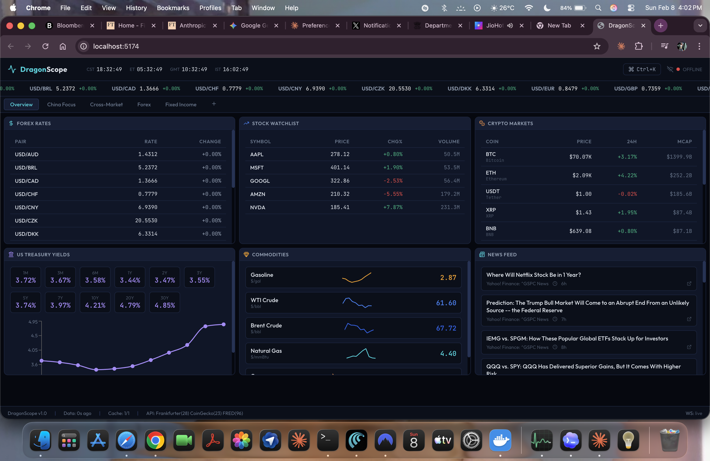
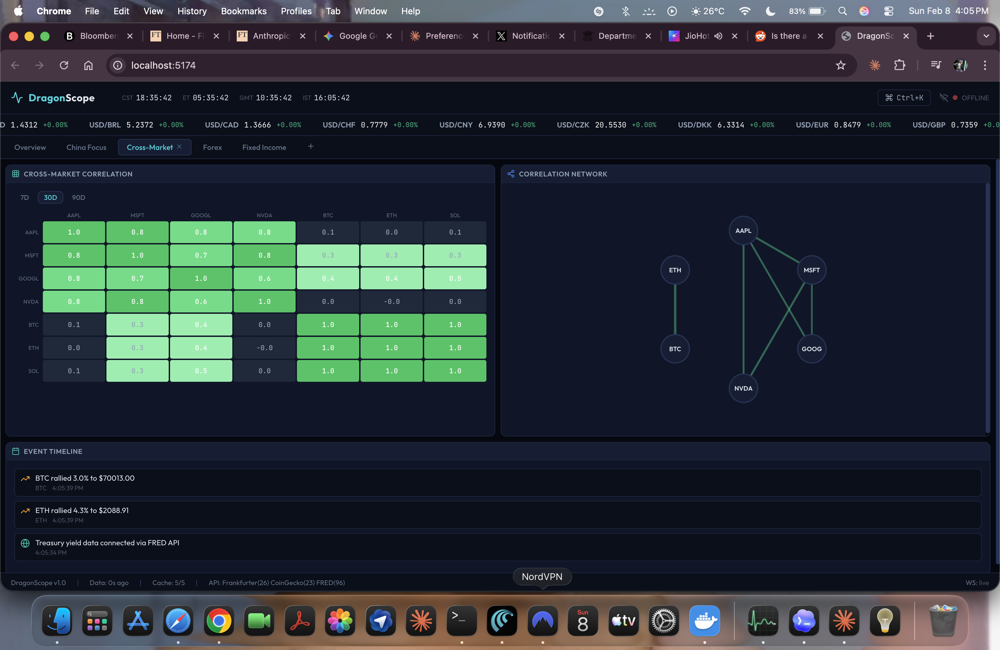
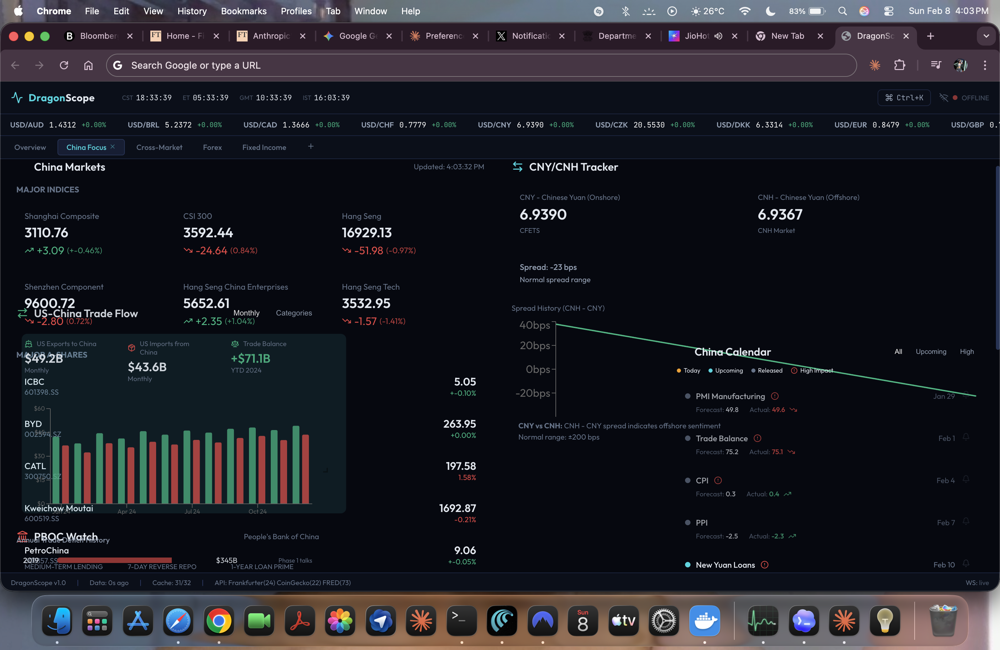
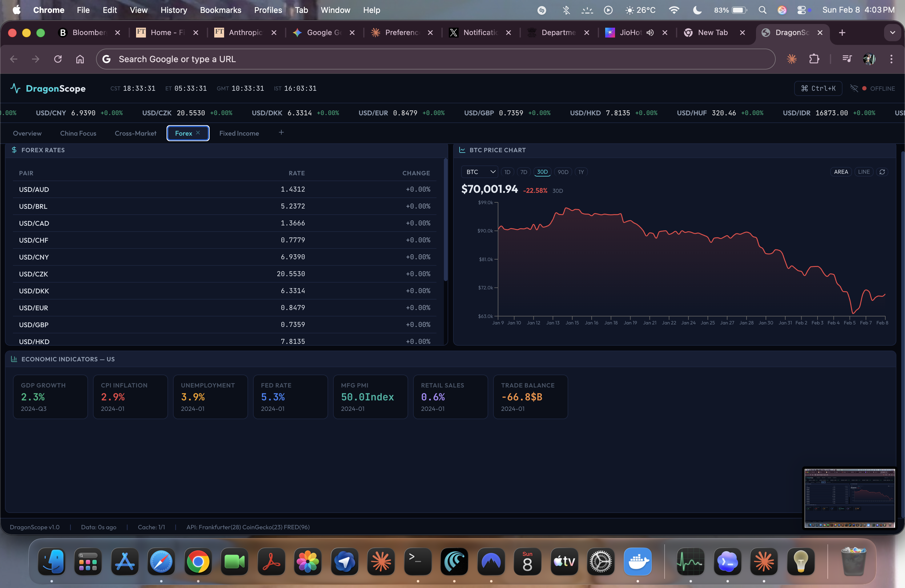

# DragonScope

A real-time financial market analytics dashboard built with React 19 and Vite 7. Features live data from 17+ API sources, in-browser SQL queries, ML-powered trading signals, and 9 customizable workspaces.



## Features

### Market Data (35 Panels)
- **Forex** - Live currency pairs from Frankfurter API
- **Stocks** - Real-time quotes via Alpha Vantage / FMP / Finnhub
- **Crypto** - Live prices from CoinGecko + Binance WebSocket
- **Bonds** - US Treasury yields from FRED API
- **Commodities** - Commodity prices from World Bank
- **Indices** - Global market indices

### Analysis Tools
- **Correlation Matrix** - Cross-asset correlation heatmap
- **Network Graph** - Visual correlation network
- **SQL Query Engine** - AlaSQL in-browser SQL over 12 tables with schema browser, saved queries, CSV export
- **Price Charts** - Interactive charts with 5 time ranges (1D/7D/30D/90D/1Y)



### ML System (In-Browser Neural Networks)
- **Price Predictor** - Direction classification (up/down) using feedforward neural network
- **Anomaly Detector** - Z-score based anomaly detection with severity levels
- **Market Regime Classifier** - Bull/bear/sideways classification
- **Signal Generator** - Composite buy/sell/hold signals combining all models
- 12 per-asset features (RSI, MACD, Bollinger, momentum, volatility, trend) + 8 cross-market features
- Auto-trains every 60s, predictions every 5s

### Research & Sentiment
- **GitHub Trending** - Finance/trading repos from GitHub API
- **HuggingFace Models** - Financial ML models
- **SEC Filings** - Real-time SEC EDGAR filings
- **Research Papers** - Quantitative finance papers from arXiv
- **Reddit Sentiment** - WSB/crypto/stocks sentiment analysis
- **Fear & Greed Index** - From alternative.me API
- **Sector Performance** - S&P sector ETF heatmap

### China Focus
- China market indices (SSE, HSI, CSI 300)
- CNY/CNH onshore vs offshore spread tracking
- PBOC policy rate monitoring
- US-China trade flow visualization



### DeFi & Crypto
- **DeFi TVL** - Protocol rankings from DeFi Llama
- **Crypto Global** - Market cap, dominance, trending coins from CoinGecko
- **Reddit Crypto** - Crypto subreddit sentiment

### News (6-Source Fallback Chain)
Finnhub -> NewsData.io -> NewsAPI.org -> WorldNewsAPI -> GNews -> Yahoo RSS



## Workspaces

9 pre-configured workspaces, switchable via keyboard shortcuts:

| Key | Workspace | Panels |
|-----|-----------|--------|
| 1 | Overview | Forex, Stocks, Crypto, Bonds, Commodities, News |
| 2 | China Focus | China Markets, CNY Tracker, PBOC Watch, Trade Flow, Calendar |
| 3 | Cross-Market | Correlation, Network, Timeline, SQL Query |
| 4 | Forex | Forex Rates, Price Chart, Economic Data |
| 5 | Fixed Income | Bonds, Economic Data, News |
| 6 | Research | GitHub, HuggingFace, arXiv, SEC, SQL Query |
| 7 | Sentiment | Fear & Greed, Sectors, Watchlist, Reddit, News |
| 8 | DeFi & Crypto | DeFi TVL, Crypto Global, Crypto Markets, Reddit |
| 9 | ML Analytics | ML Dashboard, Trading Signals, Stocks, Crypto, Sentiment |

All panels are draggable and resizable via react-grid-layout.

## Tech Stack

- **Frontend**: React 19, Vite 7
- **Charts**: Recharts
- **Layout**: react-grid-layout (drag & drop)
- **SQL**: AlaSQL (in-browser)
- **Icons**: Lucide React
- **ML**: Custom neural network (no dependencies)
- **WebSocket**: Binance real-time crypto tickers

## Data Sources (17 APIs)

| Source | Data | Auth |
|--------|------|------|
| Frankfurter | Forex rates | Free, no key |
| CoinGecko | Crypto prices, charts, global stats | Free, no key |
| Binance WS | Real-time crypto tickers | Free, no key |
| World Bank | Economic indicators, commodities | Free, no key |
| alternative.me | Fear & Greed Index | Free, no key |
| DeFi Llama | DeFi protocol TVL | Free, no key |
| GitHub API | Finance repos | Free, rate-limited |
| HuggingFace API | ML models | Free |
| SEC EDGAR | SEC filings | Free, no key |
| arXiv | Research papers | Free, no key |
| Reddit JSON | Subreddit posts | Free, no key |
| Alpha Vantage | Stock quotes | Free key required |
| FMP | Stock quotes, profiles | Free key required |
| Finnhub | Stock quotes, news | Free key required |
| FRED | Treasury yields | Free key required |
| NewsData.io | News articles | Free key required |
| NewsAPI.org | News articles | Free key required |

## Quick Start

```bash
npm install
npm run dev
```

### Environment Variables (optional)

Create a `.env` file for enhanced data:

```env
VITE_FINNHUB_API_KEY=your_key
VITE_FMP_API_KEY=your_key
VITE_ALPHA_VANTAGE_API_KEY=your_key
VITE_FRED_API_KEY=your_key
VITE_NEWSDATA_API_KEY=your_key
VITE_NEWSAPI_API_KEY=your_key
VITE_WORLD_NEWS_API_KEY=your_key
VITE_GNEWS_API_KEY=your_key
```

The app works without any API keys - it uses free public APIs and mock data fallbacks.

## Architecture

```
src/
  components/
    layout/          # AppShell, CommandBar, Header, Footer
    panels/          # 29 panel components
    panels/china/    # 6 China-specific panels
    shared/          # PanelChrome, ErrorBoundary, Toast, etc.
    charts/          # Chart primitives (Bar, Line, Gauge, Heatmap, etc.)
  services/
    api/             # 17 API service modules
    CacheManager.js  # TTL-based cache
    RateLimiter.js   # Token bucket rate limiting
    WebSocketManager.js
  hooks/             # 10 custom React hooks
  engine/            # Market, Correlation, Technical, Pattern, Timeline engines
  ml/                # Neural network, feature engineering, 4 ML models, orchestrator
  generators/        # Mock data generators
  constants/         # API endpoints, workspaces, commands, symbols
  utils/             # Formatters, math, correlation, storage helpers
  styles/            # CSS with custom properties (dark terminal theme)
```

## License

Business Source License 1.1 — See [LICENSE](LICENSE) for details.

Commercial use requires a valid license. Purchase at [dragonscope.io](https://dragonscope.io) or via AppSumo.
