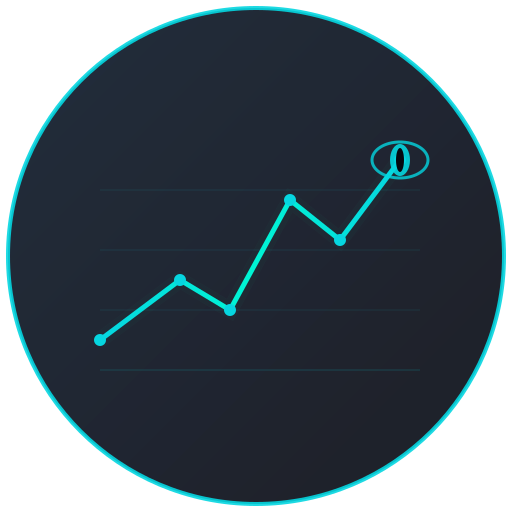

<p align="center">
  
</p>

<h1 align="center">DragonScope</h1>

<p align="center">
  <strong>Bloomberg-style financial terminal for indie traders and analysts</strong>
</p>

<p align="center">
  Real-time market data from 17+ sources &bull; 45 customizable panels &bull; In-browser ML signals &bull; SQL query engine &bull; Zero backend required
</p>

<p align="center">
  <a href="https://dragonscope.io">Website</a> &bull;
  <a href="https://appsumo.com">Get on AppSumo</a> &bull;
  <a href="#quick-start">Quick Start</a> &bull;
  <a href="#workspaces">Workspaces</a>
</p>

---


## Why DragonScope

Most financial dashboards either cost $24,000/yr (Bloomberg) or give you one asset class at a time. DragonScope puts **stocks, crypto, forex, bonds, commodities, DeFi, and research** in a single terminal with drag-and-drop layouts, in-browser machine learning, and a built-in SQL engine — all running client-side with no mandatory backend.

## Features

### 45 Panels Across Every Asset Class

| Category | Panels | Data Sources |
|----------|--------|--------------|
| **Forex** | Live rates, price charts, economic data | Frankfurter (free, no key) |
| **Stocks** | Quotes, candlestick charts, fundamentals, screener, earnings calendar, heat map | Alpha Vantage, FMP, Finnhub |
| **Crypto** | Live tickers, price charts, global stats, order book | CoinGecko + Binance WebSocket |
| **Fixed Income** | US Treasury yield curve, economic indicators | FRED API |
| **Commodities** | Prices across metals, energy, agriculture | World Bank |
| **DeFi** | Protocol TVL rankings, chain breakdown, yields | DeFi Llama |
| **China Focus** | SSE/HSI/CSI 300, CNY tracker, PBOC watch, Belt & Road, trade flows | Custom APIs |
| **India** | Indian market panel | Custom APIs |
| **Sentiment** | Fear & Greed Index, sector ETF heatmap, Reddit (WSB/crypto/stocks) | alternative.me, Reddit JSON |
| **Research** | GitHub finance repos, HuggingFace models, arXiv papers, SEC EDGAR filings | GitHub, HuggingFace, arXiv, SEC |
| **News** | 6-source fallback chain with auto-failover | Finnhub, NewsData, NewsAPI, WorldNewsAPI, GNews, Yahoo RSS |
| **Tools** | SQL query engine, correlation matrix, network graph, event timeline, portfolio tracker, watchlist, alerts, system health, settings | In-browser engines |

### In-Browser Machine Learning

No cloud APIs, no data leaving your machine. DragonScope trains and runs 4 neural network models entirely in the browser:

- **Price Predictor** — Direction classification (up/down) using a feedforward neural net
- **Anomaly Detector** — Z-score anomaly detection with severity levels
- **Market Regime Classifier** — Bull/bear/sideways classification
- **Signal Generator** — Composite buy/sell/hold signals combining all models

20 features per prediction: 12 per-asset (RSI, MACD, Bollinger Bands, momentum, volatility, trend strength) + 8 cross-market features. Auto-trains every 60s, predictions every 5s.


### SQL Query Engine

Query your market data with SQL, powered by AlaSQL running entirely in the browser:

```sql
SELECT symbol, price, changePct FROM all_assets
WHERE changePct > 2 ORDER BY changePct DESC LIMIT 20
```

- Schema browser with 12 tables (stocks, crypto, forex, bonds, commodities, indices, economic, and more)
- Saved queries with localStorage persistence
- CSV and Excel (XLSX) export
- Column sorting, copy to clipboard
- 18 built-in query presets

### Cross-Market Analysis

- **Correlation Matrix** — Heatmap of rolling correlations across any asset combination
- **Network Graph** — Visual force-directed graph of correlated asset pairs
- **Event Timeline** — Tracks significant price moves, system events, and regime changes


## Workspaces

9 pre-configured workspaces with keyboard shortcuts. All panels are draggable and resizable.

| Key | Workspace | What's Inside |
|-----|-----------|---------------|
| `1` | Overview | Forex, Stocks, Crypto, Bonds, Commodities, News, Candlestick, Portfolio |
| `2` | China Focus | China Markets, CNY Tracker, PBOC Watch, Trade Flow, Calendar |
| `3` | Cross-Market | Correlation, Network Graph, Timeline, SQL Query |
| `4` | Forex | Forex Rates, Price Chart, Economic Data |
| `5` | Fixed Income | Bonds, Economic Data, News |
| `6` | Research | GitHub, HuggingFace, arXiv, SEC Filings, Earnings Calendar, SQL |
| `7` | Sentiment | Fear & Greed, Sectors, Watchlist, Reddit, News |
| `8` | DeFi & Crypto | DeFi TVL, Crypto Global, Crypto Markets, Reddit |
| `9` | ML Analytics | ML Dashboard, Trading Signals, Stocks, Crypto, Sentiment |

Custom workspaces can be created via the command bar (`Cmd+K`).


## Quick Start

```bash
git clone https://github.com/beepboop2025/DragonScope.git
cd DragonScope
npm install
npm run dev
```

Open `http://localhost:5174`. Enter your license code to activate.

> The app works without any API keys — it uses free public APIs and falls back to mock data automatically.

### Optional: API Keys

Create a `.env` file to unlock premium data sources:

```env
# Authentication (optional — app works without Clerk)
VITE_CLERK_PUBLISHABLE_KEY=

# Stock data
VITE_FINNHUB_API_KEY=
VITE_FMP_API_KEY=
VITE_ALPHA_VANTAGE_API_KEY=

# Economic data
VITE_FRED_API_KEY=

# News
VITE_NEWSDATA_API_KEY=
VITE_NEWSAPI_API_KEY=
VITE_WORLD_NEWS_API_KEY=
VITE_GNEWS_API_KEY=
```

### Production Build

```bash
npm run build     # Outputs to dist/
npm run preview   # Preview production build locally
```

### Full-Stack (Docker)

```bash
docker compose up --build
```

Starts TimescaleDB, Redis, FastAPI backend, Celery workers, and Nginx frontend on port 80.

### Desktop App (Electron)

```bash
npm run electron:dev     # Dev mode
npm run electron:build   # Build .dmg for macOS
```

## Tech Stack

| Layer | Technology |
|-------|------------|
| **Framework** | React 19, TypeScript, Vite 7 |
| **State** | Zustand |
| **Layout** | react-grid-layout (drag & drop, responsive breakpoints) |
| **Charts** | Lightweight Charts (candlestick, area, bar), custom SVG charts |
| **SQL** | AlaSQL (in-browser) |
| **ML** | Custom neural network engine (zero dependencies) |
| **Animation** | Framer Motion |
| **Command Bar** | cmdk |
| **Icons** | Lucide React |
| **Auth** | Clerk (optional) |
| **Notifications** | Sonner |
| **Export** | xlsx (lazy-loaded) |
| **WebSocket** | Binance real-time crypto tickers |
| **Backend** | FastAPI (Python), Celery, TimescaleDB, Redis |
| **Server** | Express.js (Node.js), Prisma, SQLite |
| **Infra** | Docker Compose, Nginx, Helm charts |
| **Desktop** | Electron |
| **Deployment** | Vercel (frontend), Docker (full-stack) |

## Data Sources

| Source | Data | Auth Required |
|--------|------|:---:|
| Frankfurter | Forex rates | No |
| CoinGecko | Crypto prices, charts, global stats | No |
| Binance WebSocket | Real-time crypto tickers (sub-second) | No |
| World Bank | Economic indicators, commodity prices | No |
| alternative.me | Fear & Greed Index | No |
| DeFi Llama | DeFi protocol TVL, chains, yields | No |
| GitHub API | Finance/trading repositories | No |
| HuggingFace API | Financial ML models | No |
| SEC EDGAR | Real-time SEC filings | No |
| arXiv | Quantitative finance research papers | No |
| Reddit JSON | WSB, r/crypto, r/stocks posts | No |
| Alpha Vantage | Stock quotes, time series | Yes (free tier) |
| FMP | Stock quotes, company profiles | Yes (free tier) |
| Finnhub | Stock quotes, financial news | Yes (free tier) |
| FRED | US Treasury yields, economic data | Yes (free tier) |
| NewsData.io | News articles | Yes (free tier) |
| NewsAPI.org | News articles | Yes (free tier) |

All paid-key sources have automatic fallbacks to free alternatives or mock data.

## Architecture

```
dragonscope/
├── src/
│   ├── components/
│   │   ├── layout/          # AppShell, CommandBar, Header, Footer, WorkspaceTabs
│   │   ├── panels/          # 39 panel components (lazy-loaded)
│   │   ├── panels/china/    # 6 China-specific panels
│   │   ├── shared/          # PanelChrome, ErrorBoundary, Toast, LoadingSkeleton, etc.
│   │   ├── charts/          # 9 chart primitives + 4 lightweight-charts wrappers
│   │   └── auth/            # Clerk integration, license gate, API key manager
│   ├── services/
│   │   ├── api/             # 16 API service modules with cache + rate limiting
│   │   └── websocket/       # Binance stream, mock stream, WebSocket manager
│   ├── hooks/               # 16 custom React hooks
│   ├── engine/              # Market, Correlation, Technical, Pattern, Timeline engines
│   ├── ml/                  # NeuralNet, FeatureEngine, 4 ML models, MLEngine orchestrator
│   ├── stores/              # Zustand stores (gamification, notifications, settings)
│   ├── generators/          # Mock data generators (forex, stocks, crypto, economic)
│   ├── constants/           # Workspaces, API endpoints, symbols, commands, colors
│   ├── contexts/            # SymbolContext (cross-panel symbol linking)
│   ├── types/               # 11 TypeScript type definition files
│   ├── utils/               # Formatters, math, correlation, storage, export, motion
│   └── styles/              # CSS with custom properties (dark terminal theme)
├── server/                  # Node.js Express API (Prisma + SQLite)
├── backend/                 # Python FastAPI backend (TimescaleDB + Redis + Celery)
├── enterprise/              # Enterprise tier (microservices, Kubernetes, Terraform)
├── electron/                # Electron desktop app wrapper
├── scripts/                 # License code generator, install/uninstall scripts
└── docker-compose.yml       # Full-stack deployment
```

## Keyboard Shortcuts

| Shortcut | Action |
|----------|--------|
| `Cmd+K` / `Ctrl+K` | Open command bar |
| `1`–`9` | Switch workspace |
| `Cmd+S` | Save current layout |
| `?` | Show shortcuts modal |

## License

**Business Source License 1.1** — See [LICENSE](LICENSE) for full terms.

- Personal and non-commercial use is free
- Commercial use requires a valid license
- Purchase at [dragonscope.io](https://dragonscope.io) or via [AppSumo](https://appsumo.com)
- Converts to Apache 2.0 on the Change Date (2030-03-06)

---

<p align="center">
  Built with React 19 &bull; TypeScript &bull; Vite 7<br/>
  <sub>45 panels &bull; 17 data sources &bull; 4 ML models &bull; 0 required API keys</sub>
</p>
