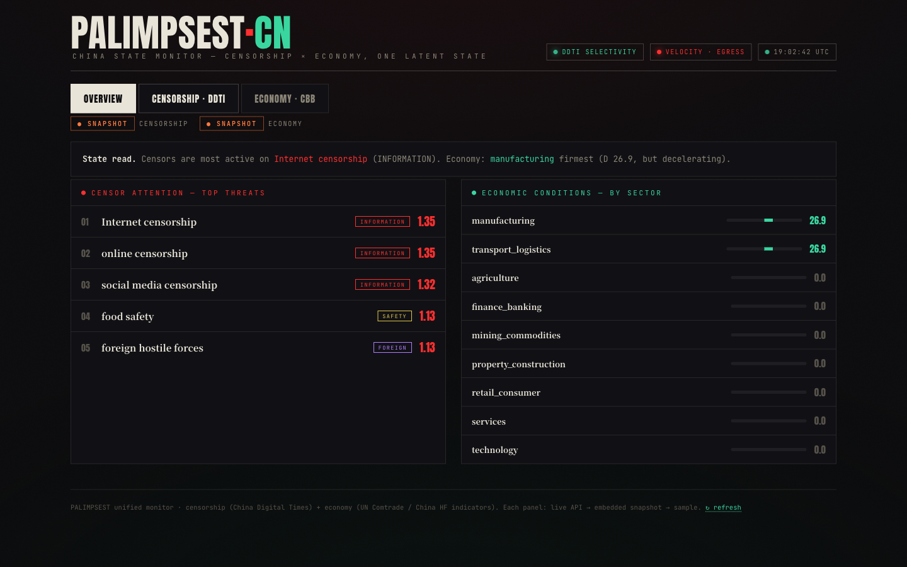

# Social Scraper Intelligence Platform

**A real-time OSINT collection-and-analysis engine: 15 data sources → NLP → routing, with a flagship China latent-state intelligence layer (PALIMPSEST) built on top.**


> Collect from many noisy, biased sources → enrich with financial NLP → route the signal to the dashboards that need it. The same primitives power a China intelligence engine that estimates a *hidden state* from sensors no single one of which can be trusted.

---

## Table of Contents

- [What this is](#what-this-is)
- [Flagship: PALIMPSEST — China latent-state intelligence](#flagship-palimpsest--china-latent-state-intelligence)
- [Platform features](#platform-features)
- [Tech stack](#tech-stack)
- [Architecture](#architecture)
- [Getting started](#getting-started)
- [Project structure](#project-structure)
- [Design principles](#design-principles)
- [License](#license)

---

## What this is

Social Scraper is a Python **collector → processor → API** platform for financial and
geopolitical open-source intelligence. It pulls from 15 source types on configurable
schedules, runs each record through a financial-NLP pipeline (sentiment, entity
recognition, topic and threat classification, embeddings), and routes the result to
downstream analytics dashboards based on relevance.

Every collector follows the same contract — `collect() → parse() → validate()`,
subclassing `core.base_collector.BaseCollector` and registered in `config/sources.yaml`
— so adding a new sensor is a single file plus a config entry. That uniformity is what
makes the China-intelligence layer below possible: it's just *more sensors*, scored by
the same machinery.

---

## Flagship: PALIMPSEST — China latent-state intelligence

**An independent, OSINT-driven read on what's actually happening inside China.** It treats
"the true state of China" as a hidden variable estimated from many biased sensors — no
single official figure is trusted; signal comes from *triangulation*. Two engines feed one
dark "intelligence terminal" dashboard:



<p align="center"><em>The PALIMPSEST terminal — Overview synthesis: censorship signal (DDTI) and economic conditions (CBB) side by side, every panel badged LIVE / SNAPSHOT.</em></p>


| Engine | What it measures | Method |
|---|---|---|
| **DDTI** — Deletion-Differential Threat Index | *Treats the censor as a sensor.* What the regime deletes, how fast, and how selectively reveals what it fears. | Ranks censored topics by **threat = attention (time-decayed frequency) × novelty (burst / first-appearance)** from China Digital Times deletion data. |
| **CBB** — China Beige-Book-style conditions engine | Sector × region economic **diffusion indices**, independent of official NBS statistics. | `D = 0.4·SD + 0.6·AS` over four independent signal families (below). |

### CBB signal families

The conditions engine no longer rests on official trade data alone — it fuses four
*independent* sensor families, each a credentials-free public source that degrades
gracefully when unreachable:

| Family | Sensors | Reads… |
|---|---|---|
| 🛰️ **Physical anchors** | VIIRS nighttime lights · Sentinel-2 scene counts · electricity generation (Ember/OWID) · AIS port-call traffic | Real economic activity from space and the grid — hard to fake. |
| 🏛️ **Elite signals** | Politburo meeting readouts · Hong Kong RVD property index · People's Daily byline frequency · SAFE balance-of-payments net errors | The regime's own behavior and capital-flow tells. |
| 📈 **Trade & indicators** | UN Comtrade mirror-trade · Chinese high-frequency indicators (`collectors/cn_hf/`) | Cross-checked partner-reported trade vs. domestic high-frequency prints. |
| 🗣️ **Sentiment** | Chinese finance/policy lexicon, negation-aware hawkish/dovish/sector scoring | Tone and policy direction in Chinese-language text. |

Every source is checked by a dedicated **quality layer** (`processors/cbb_quality.py`,
covered by `tests/`) — schema validation, numeric sanity, and freshness windows — so a
stale or malformed feed is flagged rather than silently degrading the index.

### View it

- **Offline:** open `dashboards/palimpsest_dashboard.html` (real data embedded, badged ● SNAPSHOT).
- **Served:** run the API → `GET /api/v4/ddti/app` (panels fetch live, badge ● LIVE).
- **Refresh data:** `python -m scripts.ddti_live_pull` (censorship) · `python scripts/conditions_pull.py` (economy).

---

## Platform features

### Data sources (15)

- **Social platforms** — Twitter, Reddit, Telegram, Discord, YouTube, Mastodon, Hacker News
- **Financial feeds** — SEC EDGAR filings, Central Bank publications, RSS aggregation (16 feeds)
- **Developer intelligence** — GitHub repository and release tracking
- **Dark web** — Tor SOCKS5 proxy for threat intel, IOC extraction across 8 threat categories
- **General web** — Configurable generic web scraper with article extraction

### Financial NLP

- **Sentiment** — FinBERT financial sentiment with VADER fallback; hawkish/dovish policy scoring; optional free-LLM tier above FinBERT/VADER
- **Entity recognition** — spaCy NER extended with Indian financial entities (RBI, SEBI, NSE, CCIL, FIMMDA, FBIL) and policy terms (CRR, SLR, MIBOR, TREPS, LAF, MSF)
- **Topic classification** — 13 categories spanning monetary policy, capital markets, crypto, commodities, and geopolitics
- **Ticker extraction** — automatic ticker detection, price-mention parsing, earnings sentiment, treasury-relevance scoring
- **Threat intelligence** — classification across data breach, ransomware, credential theft, financial fraud, crypto threat, insider threat, supply chain, and sanctions evasion
- **Embeddings** — all-MiniLM-L6-v2 (384-dim) in pgvector for semantic search, with Ollama fallback

### Connectors & routing

- **DragonScope** — market-analytics dashboard integration via Redis pub/sub + REST push
- **LiquiFi** — Indian treasury-management dashboard with filtered content delivery
- **Smart Router** — scores each record's relevance and forwards it to DragonScope, LiquiFi, or both

### Infrastructure

- **Celery Beat scheduler** — 24/7 collection with tiered frequencies (5 min → monthly)
- **Kafka pipeline** — decoupled ingestion and processing via topic-based streaming
- **Health monitoring** — reachability checks, structural fingerprinting, freshness tracking, Telegram alerting
- **AI-generated digests** — daily briefings via Claude or Ollama with citation-backed RAG Q&A

---

## Tech stack

| Layer | Technology |
|-------|-----------|
| API | FastAPI, Uvicorn, Pydantic v2 |
| Database | TimescaleDB (PostgreSQL 16), pgvector, Alembic |
| Queue | Apache Kafka (Confluent), Celery + Redis |
| NLP | FinBERT (transformers), spaCy, sentence-transformers, VADER |
| LLM | Anthropic Claude API, Ollama (fallback), free-LLM router |
| Scraping | httpx, BeautifulSoup, trafilatura, twikit, telethon |
| Object storage | MinIO (S3-compatible) |
| Dark web | Tor SOCKS5 proxy (dperson/torproxy) |
| Monitoring | Flower (Celery), Telegram Bot alerts |
| Containers | Docker Compose (11 services) |

---

## Architecture

```
DATA SOURCES                   PIPELINE                        SERVING
────────────                   ────────                        ───────
Twitter     ─┐                                                 FastAPI
Reddit      │                                                  ├─ /search/semantic
Telegram    │   ┌──────────┐   ┌───────────────┐               ├─ /ask (RAG)
Discord     │   │          │   │  NLP Workers  │               ├─ /trends
YouTube     ├──>│  Kafka   ├──>│  - FinBERT    │──> PostgreSQL ├─ /digest
Mastodon    │   │          │   │  - spaCy NER  │    TimescaleDB├─ /data
GitHub      │   └──────────┘   │  - Embeddings │    + pgvector ├─ /monitoring
SEC EDGAR   │                  │  - Topics     │               └─ /api/v4/ddti (PALIMPSEST)
Central Banks│                  └───────┬───────┘
Hacker News │                          │
RSS Feeds   │                          v
Dark Web    │                  ┌───────────────┐   ┌────────────────┐
Generic Web ─┘                  │    Router     │──>│  DragonScope   │
                               │  DS / LF /    │   │  (Market View) │
  China sensors:               │    Both       │   ├────────────────┤
  🛰️ physical anchors          └───────────────┘   │  LiquiFi       │
  🏛️ elite signals             ┌───────────────┐   │  (Treasury)    │
  📈 trade + indicators ──────> │  PALIMPSEST   │   └────────────────┘
  🗣️ sentiment                  │  DDTI + CBB   │──> palimpsest_dashboard.html
                               └───────────────┘
```

Data flows through three stages. **Collection**: 26 collectors pull from social platforms,
financial APIs, RSS, dark web, and China physical/elite sensors on schedules managed by
Celery Beat; raw content is published to Kafka and archived in MinIO. **Processing**:
NLP workers consume from Kafka — sentiment, entity extraction, topic/threat classification,
embeddings, plus the PALIMPSEST DDTI and CBB index processors. **Routing**: the smart
router scores each record and forwards it to DragonScope, LiquiFi, or both.

---

## Getting started

### Prerequisites

- Docker and Docker Compose
- API keys for the sources you want live (see `.env.example`)

### Setup

```bash
git clone https://github.com/beepboop2025/social-scraper.git
cd social-scraper
cp .env.example .env    # add your API keys and database password
docker compose up -d    # starts all services
```

The API is served at `http://localhost:8000`; Flower (Celery monitoring) at `http://localhost:5555`.

### Standalone (without Docker)

```bash
pip install -r requirements.txt
python scripts/init_db.py
uvicorn api.main:app --port 8000
```

### Common operations

```bash
make up        # start all services        make test     # run the pytest suite
make down      # stop all services         make init     # initialize database schema
make logs      # tail logs across services make migrate  # run Alembic migrations
make health    # system health check       make backfill # backfill 30 days of history
```

### Run it 24/7 (VPS + Google Drive backups)

For continuous operation, a production overlay runs the full stack on an
always-on Linux VPS with `restart: unless-stopped` on every service, all live
data bind-mounted onto an attached disk, and **nightly backups pushed to Google
Drive** via rclone:

```bash
docker compose -f docker-compose.yml -f deploy/docker-compose.prod.yml up -d --build
```

The `beat` service drives 24/7 collection from `config/sources.yaml`; an in-stack
`backup` service dumps Postgres + `data/` snapshots nightly and syncs them to
Drive.

**Two deployment paths:**

- **Fully cloud, zero local** → [`deploy/railway/DEPLOY_RAILWAY.md`](deploy/railway/DEPLOY_RAILWAY.md).
  Deploy every service from GitHub via the Railway dashboard — managed Postgres +
  Redis, nightly Google Drive backups, nothing installed on your machine.
- **Self-managed VPS** → [`deploy/DEPLOY.md`](deploy/DEPLOY.md). Run the full
  compose stack on your own box with data on an attached disk (disk mount, rclone
  auth, systemd boot, reverse proxy).

---

## Project structure

```
social_scraper/
├── collectors/          # 26 collectors (incl. China physical_* / elite_* / cn_hf/)
├── scrapers/            # source-specific scrapers
├── analysis/            # NLP modules (sentiment, NER, topics, threat intel)
├── processors/          # pipeline + PALIMPSEST (ddti_index, conditions_index,
│                        #   conditions_report, zh_finance, cbb_quality)
├── connectors/          # DragonScope + LiquiFi integrations + smart router
├── pipeline/            # Kafka producer/consumer
├── api/                 # FastAPI app and route modules (incl. /api/v4/ddti)
├── core/                # base collector/processor classes, registry, scheduler
├── storage/             # models, raw store, vectors, TimescaleDB
├── scheduler/           # Celery Beat configuration
├── monitoring/          # data-quality checks, health monitor, Telegram alerts
├── config/              # sources.yaml, CBB taxonomy, CN lexicons, threat categories
├── dashboards/          # palimpsest / ddti / conditions terminals
├── scripts/             # db init, backfill, live data pulls
├── tests/               # pytest suite (incl. CBB quality + source validators)
├── docker-compose.yml   # full service stack
├── Dockerfile · Makefile · requirements.txt
```

---

## Design principles

- **Estimate the hidden state, don't trust any single sensor.** Every signal is one
  biased measurement; value comes from cross-source triangulation, not from any one feed.
- **Independent of official statistics.** Physical anchors (nightlights, electricity,
  shipping) and partner-reported mirror-trade replace self-reported figures wherever possible.
- **Honest data states.** Every view badges LIVE / SNAPSHOT / SAMPLE — the system never
  fabricates signal to fill a gap, and the CBB quality layer flags stale or malformed feeds.
- **Graceful degradation.** Sources behind auth walls or geo-blocks return empty and log a
  warning rather than crashing the pipeline.
- **Egress reality.** Richer Chinese deletion/Weibo feeds need an in-China residential
  proxy; current data is what's openly reachable — and labeled as such.

---

## License

MIT
