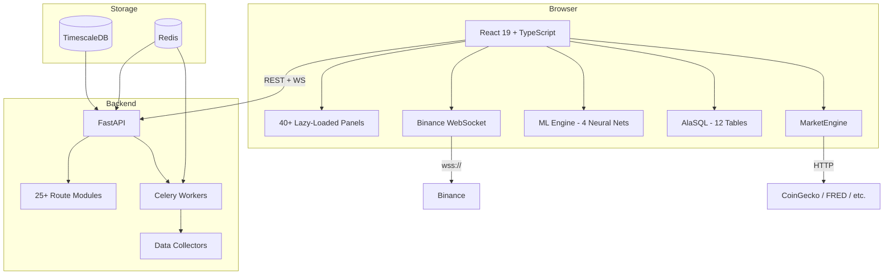

# DragonScope

**The open-source Bloomberg terminal. 40+ panels, 17 data sources, in-browser ML, real-time WebSocket feeds — for free.**


<!-- Add screenshot or demo GIF here -->
> Replace this with a screenshot of the Overview workspace showing multiple panels

---

## Why DragonScope?

Bloomberg Terminal costs **$24,000/year**. DragonScope gives you a multi-market financial terminal with real-time data, in-browser ML, a SQL query engine, and 40+ configurable panels — running in your browser, backed by 17 data sources.

**Free for personal use.** Built for quant traders, financial analysts, and indie traders who want institutional-grade tooling without the institutional price tag.

---

## Table of Contents

- [Features](#features)
- [Quick Start](#quick-start)
- [Workspaces](#workspaces)
- [Architecture](#architecture)
- [Data Sources](#data-sources)
- [ML System](#ml-system)
- [SQL Engine](#sql-engine)
- [Tech Stack](#tech-stack)
- [Deployment](#deployment)
- [Configuration](#configuration)
- [Roadmap](#roadmap)
- [Contributing](#contributing)
- [License](#license)

---

## Features

| | Feature | Description |
|---|---------|-------------|
| :bar_chart: | **40+ Interactive Panels** | Stocks, crypto, forex, bonds, commodities, DeFi, research, sentiment — all draggable and resizable |
| :zap: | **Real-Time WebSocket** | Sub-second Binance crypto tickers, live rate streaming |
| :brain: | **In-Browser ML** | 4 neural net models (price prediction, anomaly detection, regime classification, signal generation) |
| :mag: | **SQL Query Engine** | AlaSQL with 12 tables, 18 presets, CSV/XLSX export, schema browser |
| :dragon: | **China Focus** | 6 dedicated panels: SSE/HSI/CSI indices, CNY tracker, PBOC watch, Belt & Road |
| :globe_with_meridians: | **17 Data Sources** | CoinGecko, Binance WS, Alpha Vantage, FRED, Finnhub, DeFi Llama, SEC EDGAR, Reddit, arXiv, and more |
| :desktop_computer: | **9 Workspaces** | Pre-configured layouts for Overview, China, Cross-Market, Forex, Fixed Income, Research, Sentiment, DeFi, ML |
| :keyboard: | **Command Bar** | Cmd+K to search panels, workspaces, and commands |
| :package: | **Desktop App** | Electron build for macOS |
| :whale: | **Full-Stack Docker** | TimescaleDB, Redis, Celery, FastAPI backend — one command to deploy |
| :shield: | **ReadyState Integration** | Personal readiness panel — 73-item checklist with live market threat analysis ([ReadyState](https://github.com/beepboop2025/ReadyState)) |

---

## ReadyState Integration

DragonScope includes a built-in **Readiness Panel** that embeds [ReadyState](https://github.com/beepboop2025/ReadyState) — a personal resilience dashboard.

**What it does:**
- Scores your personal preparedness across 6 life domains (Financial, Supplies, Digital, Health, Skills, Network)
- Computes a market-driven **Threat Level** using live DragonScope data (yield curve, unemployment, inflation, Fear & Greed)
- Calculates **Effective Risk** = Threat × (1 − Readiness/100) — showing how your preparation reduces real-world risk
- SVG gauge and radar chart visualizations, interactive checklist with localStorage sync

**To add the panel:** Press `Cmd+K` → search "Readiness" → click to add.

Checklist state syncs with the standalone ReadyState app via `localStorage` — run both apps and your data stays in sync.

---

## Quick Start

### Frontend Only (No Backend Required)

```bash
git clone https://github.com/beepboop2025/DragonScope.git
cd DragonScope
npm install
npm run dev
```

Opens at `http://localhost:5174`. Works immediately with free-tier APIs — no keys required.

### Full Stack (Backend + Database)

```bash
docker compose up --build
```

Launches TimescaleDB, Redis, FastAPI, Celery workers, and Nginx on port 80.

### Desktop App

```bash
npm run electron:dev    # Development
npm run electron:build  # Build macOS .dmg
```

---

## Workspaces

Press `1`-`9` to switch workspaces, or use `Cmd+K`:

| Key | Workspace | Panels |
|:---:|-----------|--------|
| `1` | **Overview** | Forex, Stocks, Crypto, Bonds, Commodities, News, Candlestick, Portfolio |
| `2` | **China Focus** | SSE/HSI/CSI, CNY Tracker, PBOC Watch, Trade Flow, Calendar |
| `3` | **Cross-Market** | Correlation Matrix, Network Graph, Timeline, SQL Query |
| `4` | **Forex** | Forex Rates, Price Charts, Economic Indicators |
| `5` | **Fixed Income** | Bond Yields, Economic Data, Market News |
| `6` | **Research** | GitHub Trending, HuggingFace Models, arXiv Papers, SEC Filings, Earnings |
| `7` | **Sentiment** | Fear & Greed, Sector Performance, Reddit Sentiment, Watchlist |
| `8` | **DeFi & Crypto** | DeFi TVL Rankings, Crypto Global, Live Tickers, Reddit |
| `9` | **ML Analytics** | Training Dashboard, Buy/Sell Signals, Market Data |

All panels are **draggable and resizable**. Layouts persist in localStorage.

---

## Architecture



**Frontend**: React SPA with Zustand state, react-grid-layout for drag-drop panels, Lightweight Charts for candlesticks, and a custom neural network implementation (zero external ML dependencies).

**Backend**: FastAPI with 25+ route modules, Celery for background data collection, TimescaleDB for time-series storage with automatic compression, Redis for caching and rate limiting.

---

## Data Sources

| Source | Data | API Key |
|--------|------|:-------:|
| Frankfurter | Forex rates | No |
| CoinGecko | Crypto prices, charts, global stats | No |
| Binance WebSocket | Real-time crypto tickers | No |
| World Bank | Economic indicators, commodity prices | No |
| alternative.me | Fear & Greed Index | No |
| DeFi Llama | Protocol TVL, chain data, yields | No |
| GitHub API | Finance/trading repos | No |
| HuggingFace API | Financial ML models | No |
| SEC EDGAR | Real-time SEC filings | No |
| arXiv | Quantitative finance papers | No |
| Reddit JSON | WSB, r/crypto, r/stocks | No |
| Alpha Vantage | Stock quotes, time series | Optional |
| FMP | Company profiles, fundamentals | Optional |
| Finnhub | Stock quotes, financial news | Optional |
| FRED | Treasury yields, economic data | Optional |
| NewsData.io | News articles | Optional |
| NewsAPI.org | News articles | Optional |

Most features work without any API keys. Optional keys unlock premium data quality.

---

## ML System

Custom neural network running entirely in the browser — no server, no Python, no TensorFlow.

### 4 Models

| Model | Purpose | Method |
|-------|---------|--------|
| PricePredictor | Up/down classification | 3-layer feedforward net |
| AnomalyDetector | Unusual market behavior | Z-score detection |
| MarketRegimeClassifier | Bull/bear/sideways | Pattern classification |
| SignalGenerator | Buy/sell/hold signals | Composite of all models |

### 20 Features Per Prediction

- **12 per-asset**: RSI, MACD, Bollinger Bands, momentum, volatility, trend strength
- **8 cross-market**: VIX proxy, sector correlation, market regime, momentum aggregates

Auto-trains every 60s, generates predictions every 5s.

---

## SQL Engine

Built-in AlaSQL query engine with 12 tables:

```sql
SELECT symbol, price, change_24h, volume
FROM crypto WHERE change_24h > 5
ORDER BY volume DESC
```

**Tables**: stocks, crypto, forex, bonds, commodities, indices, economic, defi_protocols, github_repos, hf_models, reddit_posts, all_assets

**Features**: Schema browser, 18 query presets, saved queries, CSV/XLSX export, column sorting, copy to clipboard.

---

## Tech Stack

| Layer | Technology |
|-------|-----------|
| Frontend | React 19, TypeScript, Vite 7, Zustand |
| Panels | react-grid-layout, Lightweight Charts, Recharts |
| ML | Custom NeuralNet.ts (zero dependencies) |
| SQL | AlaSQL (in-memory) |
| Real-Time | Binance WebSocket |
| Backend | FastAPI, Celery, Uvicorn |
| Database | TimescaleDB (PostgreSQL + time-series) |
| Cache | Redis 7 |
| Desktop | Electron 35 |
| Deploy | Docker Compose, Nginx, Vercel (frontend) |

---

## Deployment

### Vercel (Frontend Only)

```bash
npm run build
# Connect to Vercel for auto-deploy
```

### Docker Compose (Full Stack)

```bash
docker compose up --build
# Launches: TimescaleDB, Redis, FastAPI, Celery, Nginx
```

### Electron (Desktop)

```bash
npm run electron:build  # Produces macOS .dmg
```

---

## Configuration

Frontend works out of the box. For the full backend:

| Variable | Required | Description |
|----------|:--------:|-------------|
| `DATABASE_URL` | Backend | TimescaleDB connection string |
| `REDIS_URL` | Backend | Redis connection string |
| `VITE_CLERK_PUBLISHABLE_KEY` | No | Optional Clerk auth |
| `FRED_API_KEY` | No | US Treasury yields |
| `ALPHA_VANTAGE_API_KEY` | No | Stock data |
| `FINNHUB_API_KEY` | No | Financial news |

---

## Roadmap

- [ ] Options chain panel with Greeks visualization
- [ ] AI-powered natural language market queries
- [ ] Multi-user workspaces with real-time collaboration
- [ ] Mobile-responsive layout for tablet trading
- [ ] Plugin system for custom panels and data sources

---

## Contributing

PRs welcome for bug fixes and new panels. Each panel is a self-contained lazy-loaded component in `src/components/panels/`.

To add a new panel:
1. Create `PanelYourFeature.tsx` in `src/components/panels/`
2. Add lazy import in `App.tsx`
3. Register in workspace constants

---

## License

**Business Source License 1.1** — Free for personal and non-commercial use. Commercial use requires a license. Converts to Apache 2.0 on 2030-03-06.
