# DragonScope Enterprise Architecture

> **Document Version:** 2.0  
> **Last Updated:** February 2026  
> **Classification:** Internal - Engineering Teams  
> **Owner:** Platform Architecture Team

---

## Table of Contents

1. [Executive Overview](#1-executive-overview)
2. [System Architecture](#2-system-architecture)
3. [Core Services](#3-core-services)
4. [Data Architecture](#4-data-architecture)
5. [Security & Compliance](#5-security--compliance)
6. [Scalability & Performance](#6-scalability--performance)
7. [Operational Excellence](#7-operational-excellence)
8. [Appendix](#8-appendix)

---

## 1. Executive Overview

### 1.1 Vision & Mission

**DragonScope** is a Tier-1 financial analytics terminal designed for institutional-grade market analysis, real-time risk management, and algorithmic trading execution. Built from the ground up to meet the demanding requirements of modern financial institutions, DragonScope delivers Bloomberg-terminal grade capabilities with next-generation cloud-native architecture.

### 1.2 Target User Segments

| Segment | Use Case | User Count (Est.) | Avg. Contract Value |
|---------|----------|-------------------|---------------------|
| **Hedge Funds** | Portfolio analytics, alpha generation, risk modeling | 15,000+ | $50K-500K/year |
| **Asset Managers** | Fund performance, ESG analytics, regulatory reporting | 25,000+ | $30K-200K/year |
| **Investment Banks** | Sales & trading, research distribution, M&A analysis | 40,000+ | $100K-2M/year |
| **Proprietary Trading** | Low-latency execution, market making, HFT | 5,000+ | $200K-1M/year |

### 1.3 Non-Functional Requirements (NFRs)

```
┌─────────────────────────────────────────────────────────────────┐
│                    PERFORMANCE SLAs                             │
├────────────────────────┬────────────────────────────────────────┤
│ Metric                 │ Requirement                            │
├────────────────────────┼────────────────────────────────────────┤
│ API Response Latency   │ p50: <10ms, p95: <50ms, p99: <100ms   │
│ Market Data Latency    │ <5ms (tick-to-gateway)                 │
│ UI Render Time         │ <16ms (60 FPS target)                  │
│ System Availability    │ 99.99% (52.6 min downtime/year)        │
│ Recovery Time (RTO)    │ <15 minutes                            │
│ Recovery Point (RPO)   │ <1 second                              │
│ Throughput             │ 10M+ events/second peak                │
│ Concurrent Users       │ 500,000+ per region                    │
└────────────────────────┴────────────────────────────────────────┘
```

### 1.4 Global Footprint

DragonScope operates across 5 major financial hubs with active-active deployment:

- **Americas:** NYC (Primary), Chicago (DR), São Paulo
- **EMEA:** London (Primary), Frankfurt (DR), Dubai
- **APAC:** Tokyo (Primary), Singapore (DR), Sydney, Hong Kong

---

## 2. System Architecture

### 2.1 High-Level Architecture Diagram

```mermaid
flowchart TB
    subgraph "Client Layer"
        WEB[Web Terminal<br/>React/WebGL]
        DESK[Desktop App<br/>Electron/C++]
        MOBILE[Mobile Apps<br/>iOS/Android]
        API[REST/GraphQL API Clients]
    end

    subgraph "Edge Layer"
        CF[CloudFront / Akamai]
        WAF[AWS WAF / DDoS Protection]
        GW[API Gateway<br/>Rate Limiting]
    end

    subgraph "Service Mesh"
        ISTIO[Istio Service Mesh<br/>mTLS, Traffic Management]
    end

    subgraph "Core Services"
        direction TB
        MDS[Market Data Service]
        AE[Analytics Engine]
        RMS[Risk Management]
        TES[Trading Execution]
        NLP[News & NLP Service]
        UMS[User Management & SSO]
        NTF[Notification Service]
    end

    subgraph "Data Layer"
        direction TB
        REDIS[(Redis Cluster<br/>Hot Cache)]
        TSDB[(TimescaleDB<br/>Time Series)]
        CH[(ClickHouse<br/>Analytics)]
        S3[(S3 + Athena<br/>Cold Storage)]
        KFK[Kafka Cluster<br/>Event Streaming)]
    end

    subgraph "External Integrations"
        EXCH[Exchange Feeds<br/>NYSE, NASDAQ, LSE, TSE]
        VENDOR[Data Vendors<br/>Refinitiv, Bloomberg, ICE]
        BROKER[Broker/ECN APIs]
    end

    WEB --> CF
    DESK --> CF
    MOBILE --> CF
    API --> GW
    
    CF --> WAF --> GW
    GW --> ISTIO
    
    ISTIO --> MDS
    ISTIO --> AE
    ISTIO --> RMS
    ISTIO --> TES
    ISTIO --> NLP
    ISTIO --> UMS
    ISTIO --> NTF
    
    MDS <--> REDIS
    MDS <--> TSDB
    AE <--> CH
    RMS <--> CH
    TES <--> KFK
    NLP <--> S3
    
    EXCH --> MDS
    VENDOR --> MDS
    BROKER --> TES
```

### 2.2 Data Flow Architecture

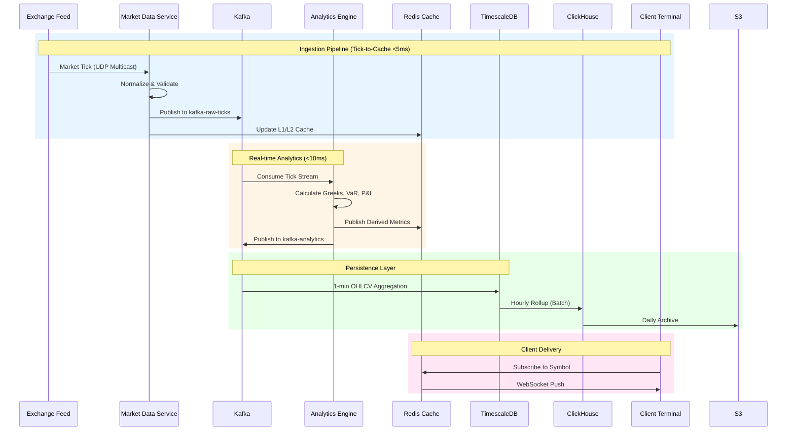

### 2.3 Multi-Region Deployment Strategy

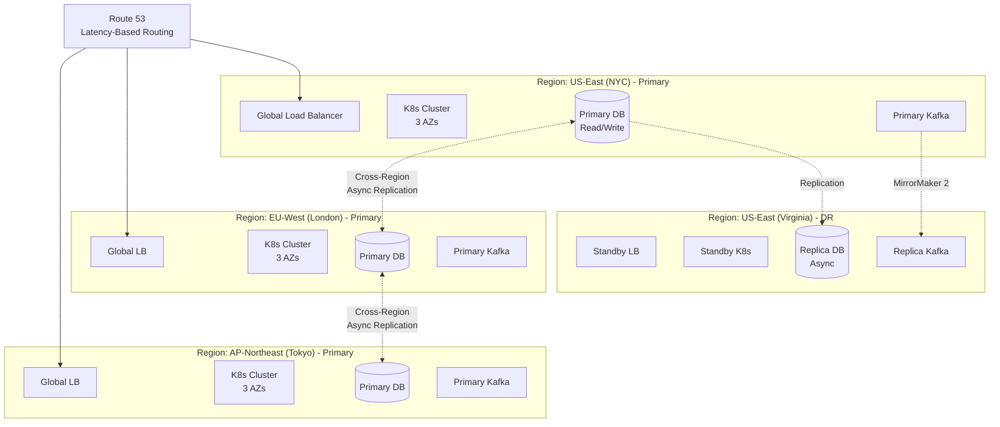

### 2.4 Availability Zones Distribution

Each primary region deploys across 3 Availability Zones for high availability:

```
┌─────────────────────────────────────────────────────────────────┐
│                     AWS Region (e.g., us-east-1)                │
│  ┌─────────────┐  ┌─────────────┐  ┌─────────────┐             │
│  │   AZ-1a     │  │   AZ-1b     │  │   AZ-1c     │             │
│  │  ┌───────┐  │  │  ┌───────┐  │  │  ┌───────┐  │             │
│  │  │K8s    │  │  │  │K8s    │  │  │  │K8s    │  │             │
│  │  │Nodes  │  │  │  │Nodes  │  │  │  │Nodes  │  │             │
│  │  └───┬───┘  │  │  └───┬───┘  │  │  └───┬───┘  │             │
│  │      │      │  │      │      │  │      │      │             │
│  │  ┌───┴───┐  │  │  ┌───┴───┐  │  │  ┌───┴───┐  │             │
│  │  │Redis  │──┼──┼──│Redis  │──┼──┼──│Redis  │  │             │
│  │  │Primary│  │  │  │Replica│  │  │  │Replica│  │             │
│  │  └───────┘  │  │  └───────┘  │  │  └───────┘  │             │
│  └─────────────┘  └─────────────┘  └─────────────┘             │
└─────────────────────────────────────────────────────────────────┘
```

---

## 3. Core Services

### 3.1 Market Data Service (MDS)

**Responsibility:** Real-time market data ingestion, normalization, and distribution

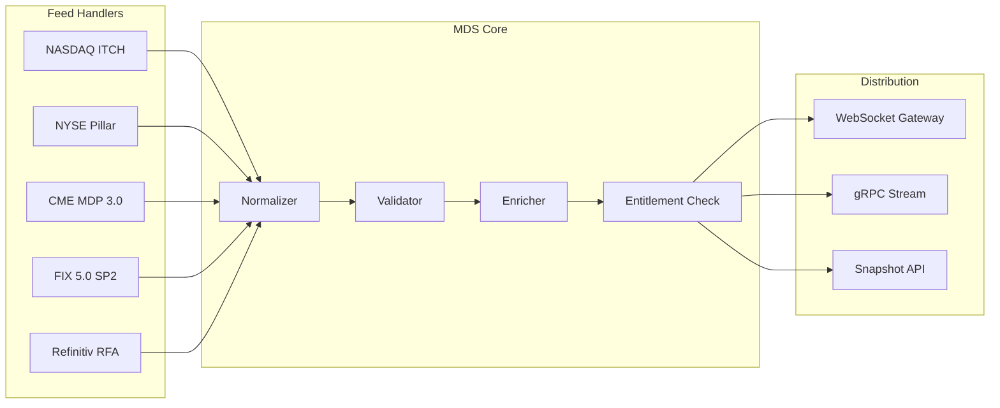

**Technical Specifications:**

| Component | Technology | Specification |
|-----------|------------|---------------|
| Feed Handlers | C++17 / FPGA | <1µs parsing latency |
| Normalizer | Rust | Zero-copy deserialization |
| Message Bus | Apache Kafka | 2M msgs/sec per partition |
| Cache Layer | Redis Cluster | 6 nodes, 64GB each |
| Protocol | WebSocket/gRPC | Binary protobuf encoding |

**Key Features:**
- **Tick-by-tick capture** with nanosecond timestamps
- **Smart order routing** data integration
- **Corporate actions** handling (splits, dividends, spin-offs)
- **Market status** and trading halt monitoring
- **Entitlement management** per symbol/asset class

---

### 3.2 Analytics Engine (AE)

**Responsibility:** Real-time quantitative calculations and portfolio analytics

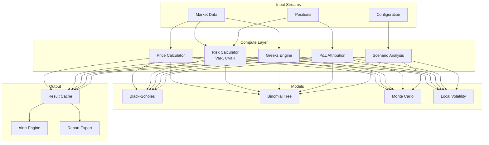

**Compute Specifications:**

| Metric | Value |
|--------|-------|
| Calculations/sec | 50M+ |
| Portfolio Size | 100K+ positions |
| Greeks Latency | <5ms for 10K options |
| VaR Compute | <100ms for full book |
| Scenario Count | 10,000+ concurrent |

---

### 3.3 Risk Management Service (RMS)

**Responsibility:** Real-time risk monitoring, limit management, and regulatory reporting

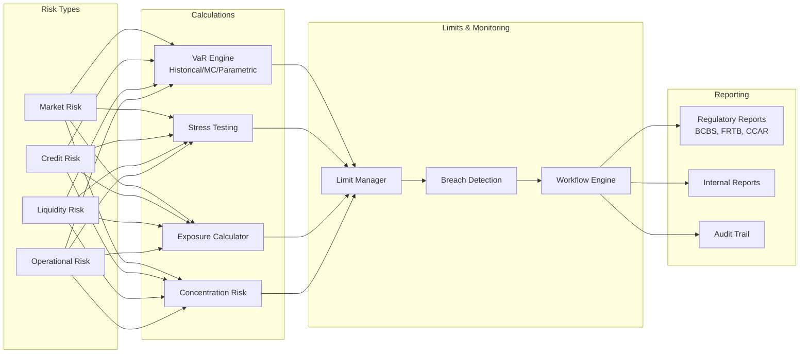

**Risk Limits Framework:**

```yaml
RiskLimits:
  MarketRisk:
    VaR_95_Daily: $10,000,000
    VaR_99_Daily: $25,000,000
    Stress_Loss: $50,000,000
    
  CreditRisk:
    Counterparty_Exposure: $100,000,000
    Settlement_Risk: $25,000,000
    
  Operational:
    Max_Order_Size: 1,000,000_shares
    Max_Notional: $500,000,000
    Velocity_Limit: 100_orders/minute
```

---

### 3.4 Trading Execution Service (TES)

**Responsibility:** Order management, smart order routing, and execution algorithms

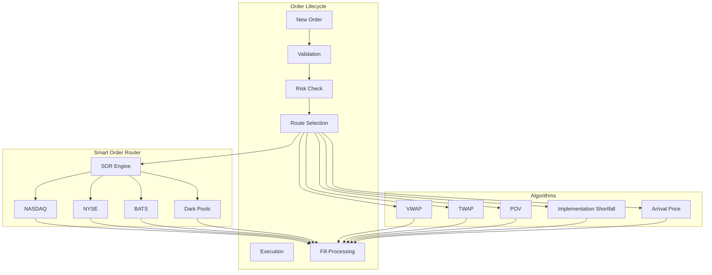

**Execution Specifications:**

| Capability | Specification |
|------------|---------------|
| Order Latency | <2ms (gateway-to-market) |
| Throughput | 100K orders/second |
| Fill Processing | <1ms acknowledgment |
| Algorithm Types | 15+ execution strategies |
| Market Coverage | 100+ global venues |

---

### 3.5 News & NLP Service

**Responsibility:** News ingestion, sentiment analysis, and entity extraction

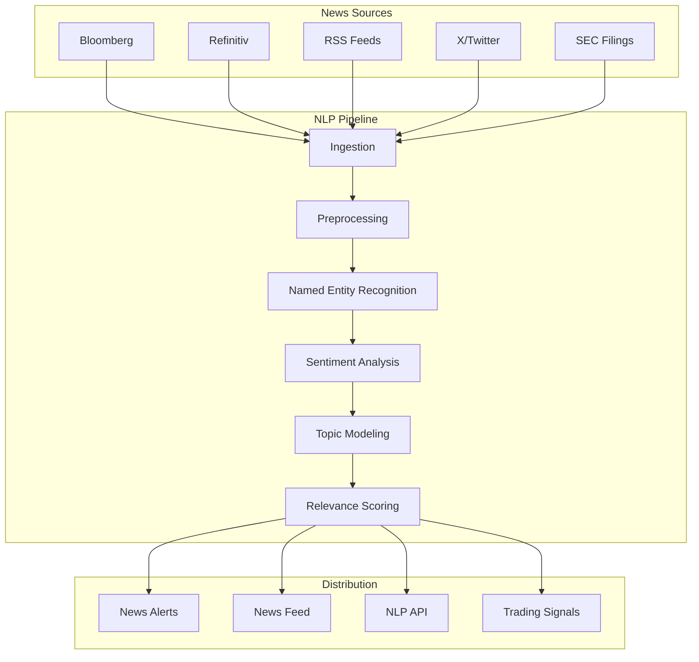

**NLP Capabilities:**

| Feature | Model/Technology | Accuracy |
|---------|------------------|----------|
| Named Entity Recognition | FinBERT + Custom | 94.5% |
| Sentiment Analysis | Fine-tuned LLM | 89.2% F1 |
| Topic Classification | BERTopic | 91% |
| Event Detection | Custom Transformers | 87% |
| Language Support | 25+ languages | - |

---

### 3.6 User Management & SSO

**Responsibility:** Authentication, authorization, and identity management

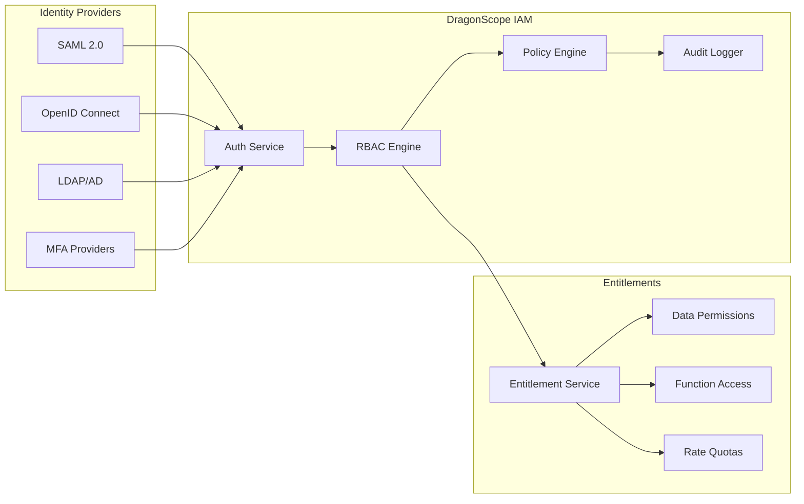

**IAM Specifications:**

| Feature | Implementation |
|---------|----------------|
| Authentication | OAuth 2.0 + OIDC |
| MFA | TOTP, WebAuthn, SMS |
| Session Management | JWT with refresh tokens |
| Role Hierarchy | 5 levels, 50+ roles |
| Permissions | 500+ granular permissions |
| Audit Retention | 7 years |

---

## 4. Data Architecture

### 4.1 Storage Tiering Strategy

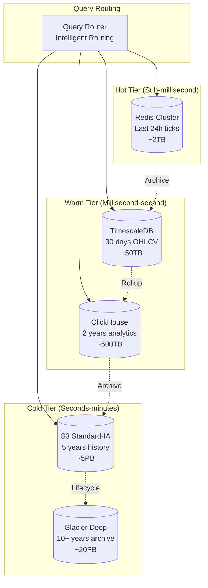

### 4.2 Hot Storage: Redis Cluster

**Purpose:** Real-time market data caching and pub/sub

```yaml
RedisConfiguration:
  Architecture: Cluster Mode
  Nodes: 6 shards × 2 replicas = 12 nodes
  Instance_Type: r6g.8xlarge
  Memory_Per_Node: 256GB
  Total_Capacity: 1.5TB
  
  Data_Structures:
    - Sorted_Sets: Price history ranking
    - Hashes: Instrument metadata
    - Streams: Real-time tick streams
    - PubSub: Channel subscriptions
    
  Persistence:
    - RDB: Every 15 minutes
    - AOF: Every second
    
  Eviction_Policy: volatile-lru
```

### 4.3 Warm Storage: TimescaleDB + ClickHouse

**TimescaleDB (Time-Series Primary):**

```sql
-- Market data hypertable setup
CREATE TABLE market_ticks (
    time TIMESTAMPTZ NOT NULL,
    symbol TEXT NOT NULL,
    price DECIMAL(18,8),
    size BIGINT,
    exchange TEXT,
    conditions TEXT[]
);

SELECT create_hypertable('market_ticks', 'time', chunk_time_interval => INTERVAL '1 hour');

-- Automatic compression after 7 days
ALTER TABLE market_ticks SET (
    timescaledb.compress,
    timescaledb.compress_segmentby = 'symbol,exchange'
);

SELECT add_compression_policy('market_ticks', INTERVAL '7 days');
```

**ClickHouse (Analytics):**

```sql
-- Analytics table with materialized views
CREATE TABLE trades (
    timestamp DateTime64(9),
    symbol String,
    price Decimal64(8),
    quantity UInt64,
    side Enum('BUY' = 1, 'SELL' = 2),
    venue LowCardinality(String)
) ENGINE = MergeTree()
ORDER BY (symbol, timestamp);

-- Materialized view for OHLCV
CREATE MATERIALIZED VIEW ohlcv_1m
ENGINE = AggregatingMergeTree()
ORDER BY (symbol, timestamp)
AS SELECT
    toStartOfMinute(timestamp) as timestamp,
    symbol,
    argMinState(price, timestamp) as open,
    maxState(price) as high,
    minState(price) as low,
    argMaxState(price, timestamp) as close,
    sumState(quantity) as volume
FROM trades
GROUP BY symbol, timestamp;
```

### 4.4 Cold Storage: S3 with Athena

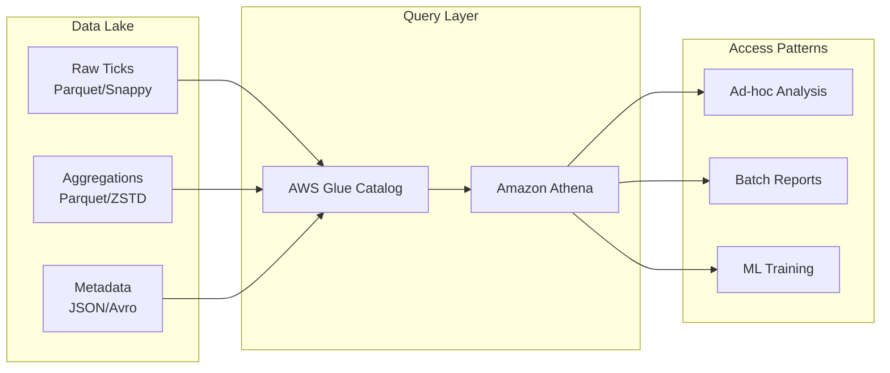

### 4.5 Data Retention Policies

| Data Type | Hot | Warm | Cold | Archive | Total Retention |
|-----------|-----|------|------|---------|-----------------|
| Ticks (L1) | 24h | 30d | 2y | 10y | 10 years |
| Ticks (L2) | - | 7d | 1y | 7y | 7 years |
| OHLCV (1m) | 1h | 90d | 5y | 20y | 20 years |
| OHLCV (1d) | 1d | 5y | 20y | Perm | Permanent |
| News | 24h | 90d | 5y | 10y | 10 years |
| Analytics | - | 30d | 2y | 7y | 7 years |
| Audit Logs | - | - | 7y | Perm | Permanent |

---

## 5. Security & Compliance

### 5.1 Security Architecture

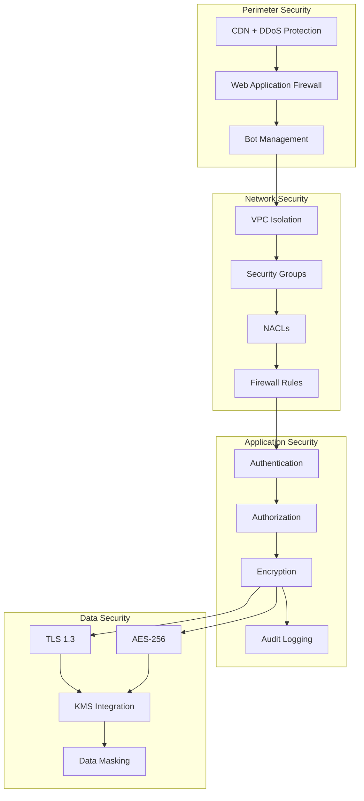

### 5.2 Encryption Standards

```yaml
Encryption_Requirements:
  In_Transit:
    Protocol: TLS 1.3
    Cipher_Suites:
      - TLS_AES_256_GCM_SHA384
      - TLS_CHACHA20_POLY1305_SHA256
    Certificate: ECDSA P-384
    HSTS: max-age=31536000
    
  At_Rest:
    Algorithm: AES-256-GCM
    Key_Management: AWS KMS / HashiCorp Vault
    Key_Rotation: 90 days
    
  Database:
    Field_Level_Encryption: PII, Credentials
    TDE: Enabled for all persistent storage
```

### 5.3 Compliance Framework

| Framework | Requirements | Status | Evidence |
|-----------|-------------|--------|----------|
| **SOC 2 Type II** | Security, Availability, Processing Integrity, Confidentiality, Privacy | ✅ Certified | Annual audit |
| **GDPR** | Data subject rights, DPO, Privacy by design | ✅ Compliant | DPIA completed |
| **FINRA** | Supervision, recordkeeping, reporting | ✅ Compliant | WSPs in place |
| **MiFID II** | Transaction reporting, best execution | ✅ Compliant | RTS 6 compliance |
| **PCI DSS** | Payment card data security | ✅ Level 1 | QSA assessment |

### 5.4 Audit Logging

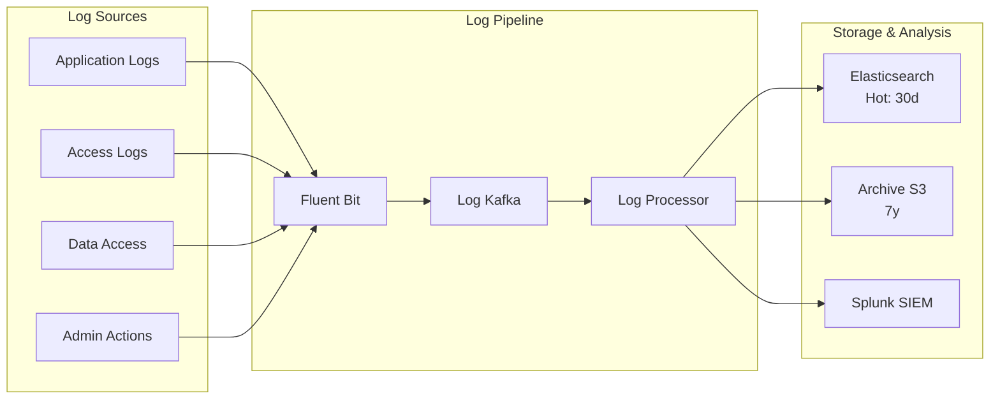

**Audit Event Schema:**

```json
{
  "event_id": "uuid",
  "timestamp": "2026-02-28T01:06:07.123456Z",
  "event_type": "DATA_ACCESS",
  "severity": "INFO",
  "actor": {
    "user_id": "user@firm.com",
    "session_id": "sess_abc123",
    "ip_address": "10.0.1.100",
    "mfa_verified": true
  },
  "resource": {
    "type": "MARKET_DATA",
    "symbol": "AAPL",
    "data_classification": "PUBLIC"
  },
  "action": "READ",
  "outcome": "SUCCESS",
  "metadata": {
    "client_version": "2.5.1",
    "api_endpoint": "/v1/quotes/AAPL"
  }
}
```

---

## 6. Scalability & Performance

### 6.1 Horizontal Scaling Strategy

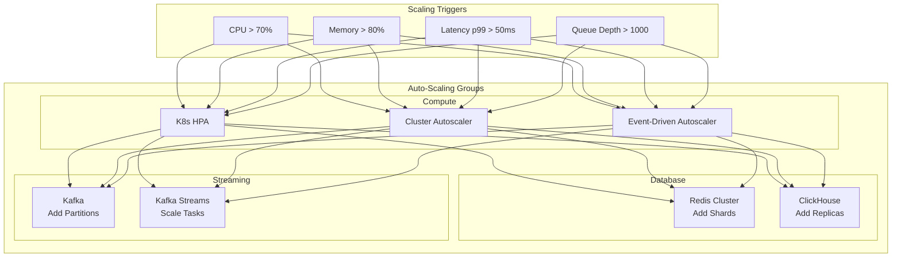

### 6.2 Load Balancing Architecture

```
┌─────────────────────────────────────────────────────────────────┐
│                    Load Balancing Layers                        │
├─────────────────────────────────────────────────────────────────┤
│                                                                 │
│  Layer 7: Application                                           │
│  ┌─────────────────────────────────────────────────────────┐   │
│  │  AWS ALB / NGINX Ingress                                │   │
│  │  - Path-based routing                                   │   │
│  │  - WebSocket support                                    │   │
│  │  - SSL termination                                      │   │
│  └─────────────────────────────────────────────────────────┘   │
│                              │                                  │
│  Layer 4: Service Mesh                                        │
│  ┌─────────────────────────────────────────────────────────┐   │
│  │  Istio Ingress Gateway                                  │   │
│  │  - Canary deployments                                   │   │
│  │  - Circuit breaking                                     │   │
│  │  - mTLS enforcement                                     │   │
│  └─────────────────────────────────────────────────────────┘   │
│                              │                                  │
│  Layer 3: Database                                            │
│  ┌─────────────────────────────────────────────────────────┐   │
│  │  PgPool / HAProxy / ClickHouse Load Balancer           │   │
│  │  - Read replica distribution                            │   │
│  │  - Connection pooling                                   │   │
│  └─────────────────────────────────────────────────────────┘   │
│                                                                 │
└─────────────────────────────────────────────────────────────────┘
```

### 6.3 Circuit Breaker Pattern

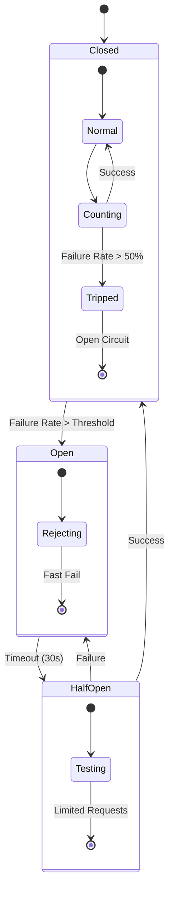

**Implementation (Go):**

```go
// Circuit breaker configuration
cbConfig := breaker.Config{
    MaxRequests: 3,           // Max requests in half-open state
    Interval: 10 * time.Second, // Statistical window
    Timeout: 30 * time.Second,  // Open state timeout
    ReadyToTrip: func(counts breaker.Counts) bool {
        failureRatio := float64(counts.TotalFailures) / float64(counts.Requests)
        return counts.Requests >= 10 && failureRatio >= 0.5
    },
}
```

### 6.4 Caching Strategy

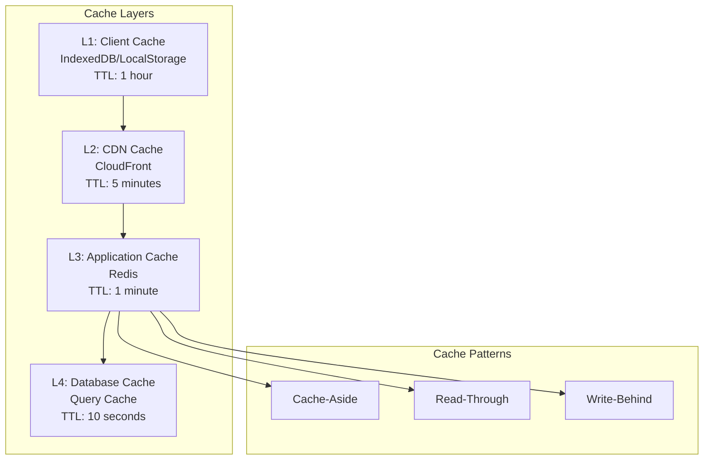

### 6.5 Performance Benchmarks

| Metric | Target | Current | Status |
|--------|--------|---------|--------|
| API p50 Latency | <10ms | 8ms | ✅ |
| API p99 Latency | <100ms | 75ms | ✅ |
| Market Data Latency | <5ms | 3ms | ✅ |
| WebSocket Broadcast | <1ms | 0.8ms | ✅ |
| Login Time | <2s | 1.5s | ✅ |
| Chart Render | <100ms | 85ms | ✅ |
| Portfolio Load (10K positions) | <500ms | 420ms | ✅ |
| Report Generation (1M rows) | <30s | 25s | ✅ |

---

## 7. Operational Excellence

### 7.1 Observability Stack

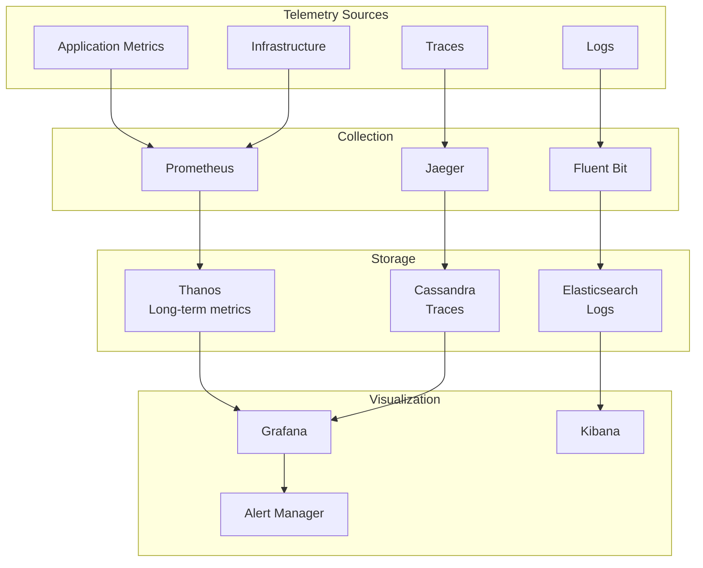

### 7.2 SLA Dashboard

```yaml
SLA_Definitions:
  Platinum:
    Availability: 99.999%
    Latency_p99: 20ms
    Support: 24/7 with 5-min response
    Price_Premium: 200%
    
  Gold:
    Availability: 99.99%
    Latency_p99: 50ms
    Support: 24/7 with 15-min response
    Price_Premium: 100%
    
  Silver:
    Availability: 99.9%
    Latency_p99: 100ms
    Support: Business hours
    Price_Premium: 0%
```

### 7.3 Incident Response

| Severity | Response Time | Resolution Target | Escalation |
|----------|--------------|-------------------|------------|
| P0 (Critical) | 5 minutes | 1 hour | CEO notification |
| P1 (High) | 15 minutes | 4 hours | VP Engineering |
| P2 (Medium) | 1 hour | 24 hours | Engineering Manager |
| P3 (Low) | 4 hours | 72 hours | Team Lead |

### 7.4 Deployment Strategy

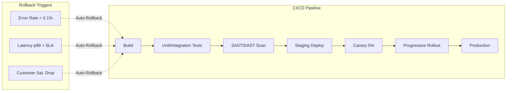

---

## 8. Appendix

### 8.1 Technology Stack Summary

| Category | Technology | Version | Purpose |
|----------|------------|---------|---------|
| **Backend** | Go | 1.21+ | Core services |
| **Backend** | Rust | 1.75+ | Market data, Performance-critical |
| **Backend** | Python | 3.11+ | Analytics, ML |
| **Frontend** | React | 18+ | Web terminal |
| **Frontend** | TypeScript | 5.3+ | Type safety |
| **Frontend** | WebGL | - | Charts, visualizations |
| **Database** | TimescaleDB | 2.13+ | Time-series data |
| **Database** | ClickHouse | 24.1+ | Analytics |
| **Database** | Redis | 7.2+ | Caching |
| **Streaming** | Apache Kafka | 3.6+ | Event streaming |
| **Container** | Kubernetes | 1.29+ | Orchestration |
| **Service Mesh** | Istio | 1.20+ | Traffic management |
| **Monitoring** | Prometheus/Grafana | Latest | Observability |
| **Cloud** | AWS | - | Primary provider |

### 8.2 Network Topology

```
┌─────────────────────────────────────────────────────────────────┐
│                        AWS Cloud                               │
│  ┌─────────────────────────────────────────────────────────┐   │
│  │                    VPC (10.0.0.0/16)                    │   │
│  │  ┌─────────────┐  ┌─────────────┐  ┌─────────────┐     │   │
│  │  │  Public     │  │  Private    │  │  Database   │     │   │
│  │  │  Subnet     │  │  Subnet     │  │  Subnet     │     │   │
│  │  │  (ALB)      │  │  (EKS)      │  │  (RDS/Redis)│     │   │
│  │  │  10.0.1.0/24│  │  10.0.2.0/24│  │  10.0.3.0/24│     │   │
│  │  └─────────────┘  └─────────────┘  └─────────────┘     │   │
│  │         │                │                │             │   │
│  │    ┌────┴────┐      ┌────┴────┐      ┌────┴────┐       │   │
│  │    │  NAT    │      │  VPC    │      │ VPC     │       │   │
│  │    │ Gateway │      │Peering  │      │Endpoint │       │   │
│  │    └────┬────┘      └────┬────┘      └────┬────┘       │   │
│  │         │                │                │             │   │
│  │    ┌────┴────┐      ┌────┴────┐      ┌────┴────┐       │   │
│  │    │Internet │      │Direct   │      │Private  │       │   │
│  │    │ Gateway │      │Connect  │      │Link     │       │   │
│  │    └─────────┘      └─────────┘      └─────────┘       │   │
│  └─────────────────────────────────────────────────────────┘   │
└─────────────────────────────────────────────────────────────────┘
```

### 8.3 Capacity Planning

| Resource | Current | 6 Months | 12 Months | Growth Rate |
|----------|---------|----------|-----------|-------------|
| Compute (vCPU) | 10,000 | 15,000 | 25,000 | 150%/year |
| Memory (TB) | 40 | 60 | 100 | 150%/year |
| Storage Hot (TB) | 20 | 30 | 50 | 150%/year |
| Storage Warm (PB) | 1 | 1.5 | 3 | 200%/year |
| Storage Cold (PB) | 10 | 15 | 30 | 200%/year |
| Network (Gbps) | 100 | 150 | 300 | 200%/year |

### 8.4 Glossary

| Term | Definition |
|------|------------|
| **Tick** | A single trade or quote update |
| **L1/L2/L3** | Market data levels (top of book, full book, full depth) |
| **Greeks** | Sensitivity measures for options (Delta, Gamma, Theta, Vega) |
| **VaR** | Value at Risk - statistical measure of portfolio risk |
| **SOR** | Smart Order Router - algorithm for optimal execution |
| **OHLCV** | Open, High, Low, Close, Volume - standard price data |
| **FPGA** | Field Programmable Gate Array - hardware acceleration |

---

## Document Control

| Version | Date | Author | Changes |
|---------|------|--------|---------|
| 1.0 | 2025-06-15 | Platform Team | Initial release |
| 1.1 | 2025-09-20 | Platform Team | Added ClickHouse details |
| 2.0 | 2026-02-28 | Platform Team | Multi-region expansion, compliance updates |

---

**Next Review Date:** 2026-05-28

**Document Owner:** platform-architecture@dragonscope.io

**Approved By:** 
- CTO: _________________ Date: _______
- CISO: _________________ Date: _______
- Head of Engineering: _________________ Date: _______
