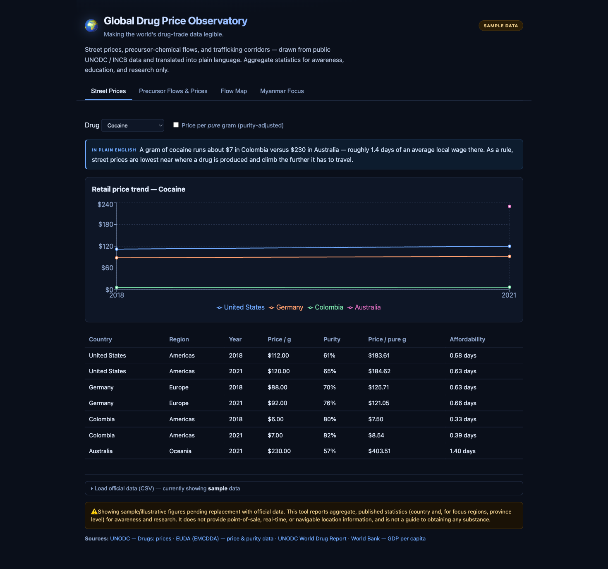
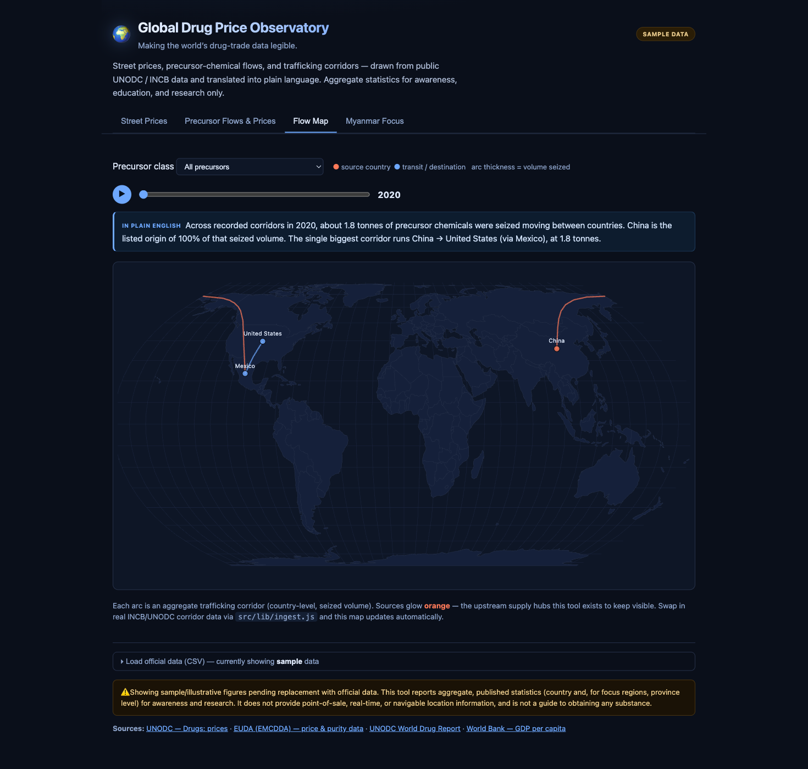
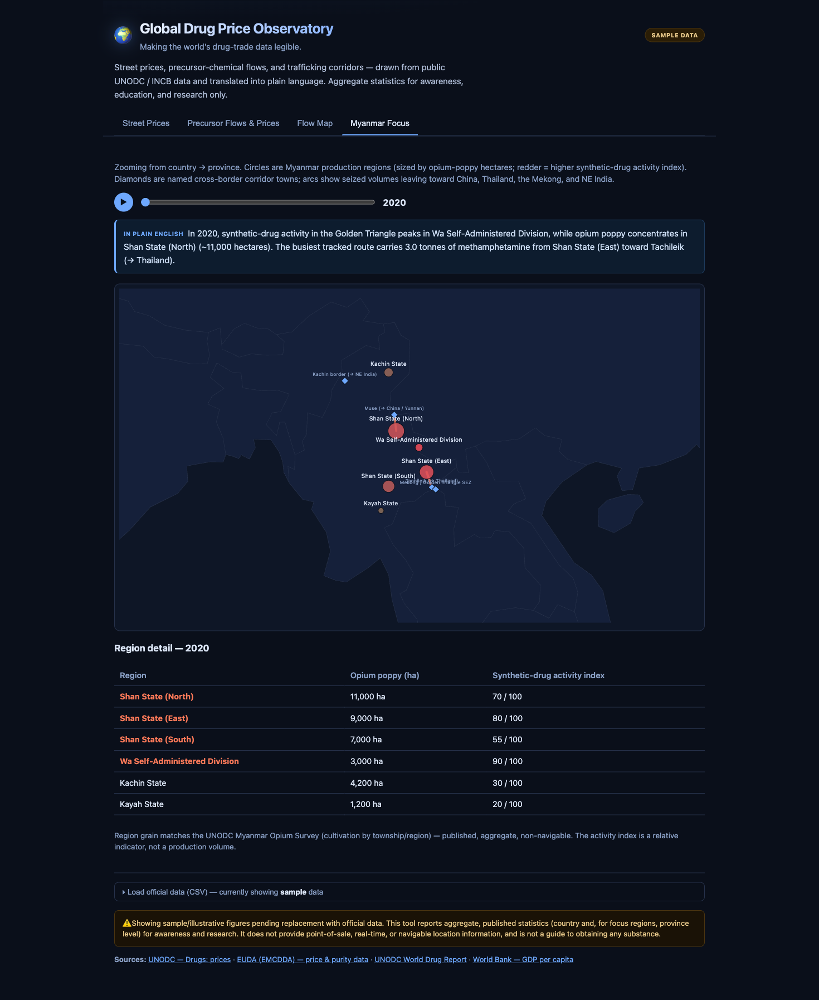

# 🌍 Global Drug Price Observatory

An educational, public-good **data explorer** that makes the world's drug-trade
data *legible*. UNODC, INCB, and EUDA already publish street (retail) prices,
precursor-chemical prices, and trafficking-flow/seizure data — but it's buried in
dense PDFs and CSVs most people can't read. This app is a **translation layer** on
top of that public data: clean charts, maps, and plain-English explanations.

> **Mission:** democratize hard-to-read official drug data. Not a new data source —
> a way to *understand* the existing one.

## What it shows

- **Street Prices** — retail price trends by country, with a purity-adjusted view
  and an *affordability* lens (price expressed as days of average local income).
- **Precursor Flows & Prices** — trafficking corridors and precursor-chemical
  prices, with source hubs (notably China) highlighted.
- **Flow Map** — an Equal-Earth world map of corridor arcs, animated over time.
- **Myanmar Focus** — province-level (Golden Triangle) detail: production regions,
  cross-border corridor towns, and seized volumes.

Every view carries an auto-generated *"In plain English"* sentence and hover
tooltips that explain each figure in human terms.

## Screenshots

> Showing sample/illustrative data (the in-app badge flips to "Live data" once real official figures are loaded).

**Street Prices** — price trends + affordability lens, with a plain-English summary:



**Flow Map** — Equal-Earth world map of precursor corridors, animated by year:



**Myanmar Focus** — province-level Golden Triangle detail:



## Ethical scope (please read)

This tool reports **aggregate, published statistics** — country-level, annual, and
(for focus regions) province-level — strictly for **awareness, education, and
research**. By design it does **not** provide point-of-sale, real-time, sub-street,
or navigable location data, and the precursor layer stores **logistics only** (what,
how much, where, control status) with **no chemistry, synthesis routes, or yields**.
It is not, and must not be used as, a guide to obtaining any substance.

## Data provenance

⚠️ **The bundled figures are illustrative samples**, shaped to the structure of the
official datasets but **not authoritative**. Replace them with real exports before
presenting anything as factual:

- UNODC — Drugs: prices & World Drug Report — https://dataunodc.un.org
- INCB — Precursors annual report & PICS — https://www.incb.org/incb/en/precursors/
- EUDA (EMCDDA) — price & purity — https://www.euda.europa.eu/data
- World Bank — GDP per capita — https://data.worldbank.org

Load real data through the **"Load official data (CSV)"** panel in the footer; each
file is parsed by `src/lib/ingest.js` and bad rows are reported, not silently dropped.
See `src/lib/ingest-config-reference.md` for the column mapping.

## Tech

React 18 · Vite 5 · Recharts · react-simple-maps (world-atlas bundled locally).
Runtime data store (`src/lib/dataStore.js`) swaps sample → real data on load.

## Develop

```bash
npm install
npm run dev        # local dev server
npm run build      # type-check (tsc) + production build → dist/
npm run preview    # preview the build
npm run typecheck  # tsc --noEmit
npm test           # run unit tests (Vitest)
```

## Deploy (Vercel)

The repo is Vercel-ready (`vercel.json` pins the Vite framework). Either:

- **Dashboard:** import the Git repo at vercel.com — zero config, auto-detected.
- **CLI:** `npx vercel` (preview) / `npx vercel --prod` (production).

## Status / TODO

- `purityAdjustedPrice()` in `src/lib/metrics.js` is an intentional stub — the
  null-purity policy is an editorial choice left to the maintainer.
- Load and **verify** real UNODC/INCB data (the main remaining step).
